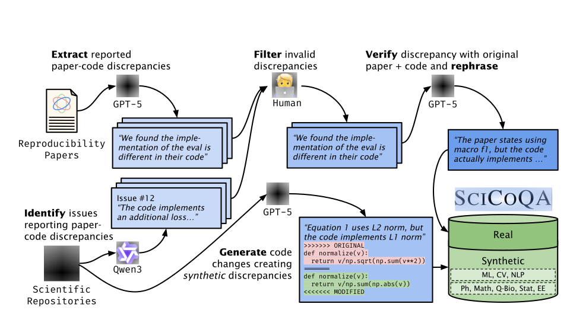

# SciCoQA: Quality Assurance for Scientific Paper-Code Alignment
<p align="center">
  <a href="https://arxiv.org/abs/tbd">
    
  </a>
  <a href="https://github.com/UKPLab/scicoqa">
    
  </a>
  <a href="https://huggingface.co/datasets/UKPLab/scicoqa">
    
  </a>
  <a href="https://huggingface.co/spaces/UKPLab/scicoqa">
    
  </a>
</p>

A dataset and codebase for detecting discrepancies between scientific publications and their code implementations.




## Table of Contents

- [Dataset](#dataset)
- [Quick Start](#quick-start)
- [Setup](#setup)
- [Project Structure](#project-structure)
- [Dataset Creation](#dataset-creation)
- [Inference](#inference)
- [Evaluation](#evaluation)
- [License](#license)

---

## Dataset

The dataset is available on HuggingFace: [**UKPLab/scicoqa**](https://huggingface.co/datasets/UKPLab/scicoqa)

It consists of paper-code discrepancies with two splits:
- **`real`**: 81 real-world discrepancies from GitHub issues and reproducibility papers
- **`synthetic`**: 530 synthetically generated discrepancies

Local copies are also available in `data/` as JSON Lines files.

### Data Format

Each entry contains:
- **Paper information**: URL and versioned PDF link
- **Code information**: Repository URL and commit hash
- **Discrepancy details**: Description of the mismatch between paper and code
- **Relevant paper sections**: Quotes from the paper
- **Relevant code files**: List of code files where the discrepancy occurs
- **Origin metadata**: Source (GitHub issue, reproducibility paper, or synthetic)
- **Changed code** (synthetic only): Code files and snippets that were modified

Example entry:
```json
{
  "discrepancy_id": "63197a77",
  "paper_url": "https://arxiv.org/abs/2106.09685",
  "paper_url_versioned": "https://arxiv.org/pdf/2106.09685v2.pdf",
  "code_url": "https://github.com/microsoft/LoRA",
  "code_url_versioned": "https://github.com/microsoft/LoRA/tree/a0d5efe...",
  "discrepancy_description": "The paper specifies initialization...",
  "relevant_paper_sections": ["We use a random Gaussian initialization..."],
  "relevant_code_files": ["loralib/layers.py"],
  "origin_type": "GitHub Issue",
  "discrepancy_type": "Difference",
  "discrepancy_category": "Model"
}
```

---

## Quick Start

**Load the dataset from HuggingFace**:
```python
from datasets import load_dataset

# Load from HuggingFace Hub
dataset = load_dataset("UKPLab/scicoqa")

# Access splits
real_data = dataset["real"]
synthetic_data = dataset["synthetic"]

# Access discrepancy information
discrepancy = real_data[0]
print(f"Paper: {discrepancy['paper_url']}")
print(f"Code: {discrepancy['code_url']}")
print(f"Description: {discrepancy['discrepancy_description']}")
```

**Using the SciCoQA library**:
```python
from scicoqa.core import load_scicoqa

# Load as pandas DataFrame
df_real = load_scicoqa(split="real")
df_synthetic = load_scicoqa(split="synthetic")

# Or load from local files
df_real = load_scicoqa(split="real", use_local=True)
```

---

## Setup
### Dependencies

The project uses `uv` for package management. You can also use other package managers (pip, poetry, etc.) by installing dependencies from `pyproject.toml`.

**With uv** (recommended):
```bash
uv venv .venv
source .venv/bin/activate  # On Windows: .venv\Scripts\activate
uv sync
```

**With pip**:
```bash
python -m venv .venv
source .venv/bin/activate
pip install -e .
```

**Requirements**: Python 3.13+

### Environment Variables

Create a `.env` file in the root directory with the following:

- `OLLAMA_API_BASE`: Base URL of the Ollama instance
- `VLLM_API_BASE`: Base URL of the VLLM instance
- `MISTRAL_API_KEY`: API key for Mistral API
- `OPENAI_API_KEY`: API key for OpenAI API
- `GEMINI_API_KEY`: API key for Gemini API
- `GITHUB_TOKEN`: GitHub token for API access
- `HF_TOKEN`: Hugging Face token for model downloads

**Note**: The dataset files can be used without API keys. API keys are only needed for running inference and evaluation.

### Extracting Pre-generated Results

If you have received the project with compressed archives instead of the full `out/` directory, you can extract them to restore the directory structure.

The archives are located in the `out/` directory and are split as follows:
- `out/data_collection.tar.gz`: Contains all data collection outputs (GitHub classification, validation, reproducibility extraction, etc.)
- `out/inference_discrepancy_detection_real.tar.gz`: Contains inference results on real data (both full and code_only)
- `out/inference_discrepancy_detection_synthetic_code_only.tar.gz`: Contains inference results on synthetic data (code_only experiments)
- `out/inference_discrepancy_detection_synthetic_full.tar.gz`: Contains inference results on synthetic data (full context experiments)
- `out/inference_*.tar.gz`: Any other inference-related archives

Each archive contains only the following file types:
- `generations.jsonl`: Model generation outputs
- `discrepancy_issues-positives.jsonl`: Classified discrepancy issues
- `predictions_and_classifications.jsonl`: Predictions and classifications
- `classifications.json`: Classification results
- `similarities.jsonl`: Similarity scores

To extract all archives and restore the `out/` directory structure:

```bash
./extract_out.sh
```

This script will:
1. Look for archives in the `out/` directory
2. Extract each archive to its correct location
3. Preserve the original directory structure

**Note**: The archives are created by running `./out.sh`, which compresses the `out/` directory contents and places the archives in the `out/` directory itself.

## Project Structure

```
scicoqa-submission-arr-januar-2026/
├── data/
│   ├── scicoqa-real.jsonl           # Real-world discrepancies (81 entries) - local copy
│   └── scicoqa-synthetic.jsonl      # Synthetic discrepancies (530 entries) - local copy
├── config/
│   ├── data.yaml                    # Repository metadata, reproducibility paper info
│   ├── models.yaml                  # LLM configurations (GPT, Gemini, etc.)
│   └── prompts.yaml                 # Prompts for discrepancy detection, generation, etc.
├── scicoqa/
│   ├── core/                        # Core functionality (LLM interface, experiment management)
│   ├── github/                      # GitHub crawling and issue processing
│   ├── inference/                   # Inference scripts (discrepancy detection, generation)
│   └── evaluation/                  # Evaluation and metrics computation
├── out/                             # Output directory
│   ├── data_collection/             # Dataset curation outputs
│   │   ├── github_crawl/            # GitHub repository crawl results
│   │   ├── github_classification/   # GitHub issue classification
│   │   ├── github_validation/       # GitHub discrepancy validation
│   │   ├── reproducibility_extraction/     # Extract discrepancies from papers
│   │   ├── reproducibility_validation/     # Validate paper discrepancies
│   │   └── synthetic_generation/           # Generate synthetic discrepancies
│   └── inference/                   # Model inference results
│       └── discrepancy_detection/   # Discrepancy detection experiments
│           ├── real/                # Experiments on real data
│           │   ├── full/            # Full paper + code context
│           │   └── code_only/       # Ablation: code only
│           └── synthetic/           # Experiments on synthetic data
│               ├── full/
│               └── code_only/
├── out.sh                           # Script to create compressed archives from out/
├── extract_out.sh                   # Script to extract archives and restore out/
├── pyproject.toml                    # Project dependencies and configuration
└── README.md                        # This file
```

### Key Files

- **HuggingFace Dataset**: [`UKPLab/scicoqa`](https://huggingface.co/datasets/UKPLab/scicoqa) - Primary source for the dataset
- **Local dataset files** (`data/*.jsonl`): Local copies of the benchmark data in JSON Lines format
- **Configuration** (`config/*.yaml`): All model, prompt, and data configurations
- **Inference scripts** (`scicoqa/inference/*.py`): Run discrepancy detection, synthetic generation, etc.
- **Core library** (`scicoqa/core/`): Reusable components for LLM interaction, prompting, dataset loading, and experiment tracking

## Dataset Creation
### 1. Real Data
#### GitHub Crawl
To run the GitHub crawl, you need to provide the search string, qualifiers, and filter homepage by. For example, to crawl all repositories from arXiv between 2025-01-01 and 2025-01-07, run the following command:
```bash
start_date="2025-01-01"
end_date="2025-01-07"
search_str="arxiv.org"
filter_homepage_by="${search_str}"

uv run python scicoqa/github/crawl.py \
    --search_str "${search_str}" \
    --qualifiers "sort:stars" "order:desc" "created:${start_date}..${end_date}" \
    --filter_homepage_by "${filter_homepage_by}"
```
For the dataset we use, we crawled all repositories from arXiv between 2020-01-01 and 2025-09-30, and filtered the repositories by the homepage being `arxiv.org`, `openreview.net`, `aclanthology.org`, `doi.org/10.1145`.

For arxiv, the crawl should be performed on a weekly basis, since typically there are many papers. For others, the crawl can be performed on a monthly basis.

#### GitHub Issue Classification
To classify the GitHub issues, we used Qwen3 4B Thinking with Ollama. To reproduce, first make sure have access to an Ollama instance and set the `OLLAMA_API_BASE` environment variable to the host of the Ollama instance. Then, run the following command:
```bash
uv run python -m scicoqa.inference.github_classification --model qwen-3-4b-thinking --prompt github_issue_discrepancy_classification_v2 --dir_suffix qwen_3_4b_think --decoding_config low_temperature
```

Using the output of the issue classification, we manually annotated the discrepancies and saved the annotated discrepancies in `discrepancy_issues-positives.jsonl`

#### GitHub Issue Verification
Finally, to verify the discrepancies, we used GPT-5.
```bash
uv run python -m scicoqa.inference.github_validation --model gpt-5 --prompt discrepancy_issue_verification_v2 --dir_suffix gpt_5 --decoding_config gpt_5_high_reasoning --discrepancy_file discrepancy_issues-positives.jsonl --add_comments 
```
#### Reproducibility Paper Extraction
To extract the discrepancies from the reproducibility papers, we used GPT-5. To reproduce, run the following command:
```bash
uv run python -m scicoqa.inference.reproducibility_extraction --prompt reproducibility_report_discrepancy_extraction_v3 --iterate_over reproducibility_paper --model gpt-5 --decoding_config gpt_5_high_reasoning
```

#### Reproducibility Paper Verification
To verify the discrepancies from the reproducibility papers, we used GPT-5. To reproduce, run the following command:
```bash
uv run python -m scicoqa.inference.reproducibility_validation --prompt reproducibility_report_discrepancy_verification --model gpt-5 --decoding_config gpt_5_high_reasoning
```

### 2. Synthetic Data

#### Synthetic Data Generation

For **Computer Science papers**:
```bash
uv run python -m scicoqa.inference.synthetic_generation \
    --model gpt-5 \
    --dir_suffix gpt-5 \
    --decoding_config gpt_5_high_reasoning \
    --num_discrepancies 5 \
    --prompt synthetic_discrepancy_generation_cs \
    --data_config_section synthetic_discrepancies_cs \
    --paper_url_field arxiv_url_versioned
```

For **non-CS papers** (Physics, Biology, etc.):
```bash
uv run python -m scicoqa.inference.synthetic_generation \
    --model gpt-5 \
    --dir_suffix gpt-5 \
    --decoding_config gpt_5_high_reasoning \
    --num_discrepancies 5 \
    --prompt synthetic_discrepancy_generation_v2 \
    --data_config_section synthetic_discrepancies \
    --paper_url_field arxiv_url
```

**Note**: Synthetic generation requires GPT-5 API access. Repository metadata is configured in `config/data.yaml`.

## Inference
To run inference, run the following command.

**Parameters**:
- `--dataset_split`: Dataset split to use (`real` or `synthetic`). Default: `real`.
- `--prompt`: Prompt template. Use `discrepancy_generation` for full context or `discrepancy_generation_code_only` for the code-only ablation.
- `--model`: The model to use for inference. See `config/models.yaml` for available models.
- `--use_local`: (Optional) Use local JSONL files instead of HuggingFace Hub.

**Note**: The output directory is automatically determined based on the dataset and prompt:
- Real + Full context → `out/inference/discrepancy_detection/real/full/`
- Real + Code only → `out/inference/discrepancy_detection/real/code_only/`
- Synthetic + Full context → `out/inference/discrepancy_detection/synthetic/full/`
- Synthetic + Code only → `out/inference/discrepancy_detection/synthetic/code_only/`

The run directory name will automatically include the model name as a suffix (e.g., `discrepancy_gen-001-gpt-5` for real data, `discrepancy_gen_synthetic-001-gpt-5` for synthetic data). You can override this by explicitly setting `--dir_suffix`.

**Example: Run on real data with full context**
```bash
uv run python -m scicoqa.inference.discrepancy_detection \
    --model gpt-5-flex \
    --decoding_config gpt_5_high_reasoning \
    --prompt discrepancy_generation \
    --dataset_split real
```

**Example: Run on synthetic data with code-only ablation**
```bash
uv run python -m scicoqa.inference.discrepancy_detection \
    --model gpt-5-flex \
    --decoding_config gpt_5_high_reasoning \
    --prompt discrepancy_generation_code_only \
    --dataset_split synthetic
```

**Example: Use local files instead of HuggingFace**
```bash
uv run python -m scicoqa.inference.discrepancy_detection \
    --model gpt-5-flex \
    --decoding_config gpt_5_high_reasoning \
    --prompt discrepancy_generation \
    --dataset_split real \
    --use_local
```

## Evaluation

### Running Evaluation

Deploy GPT-OSS 20B on VLLM, then run:

```bash
GENERATIONS_DIR=out/inference/discrepancy_detection/real/full/discrepancy_gen-002-gpt-5-nano
uv run python -m scicoqa.inference.discrepancy_eval \
    --model "vllm-gpt-oss-20b" \
    --generations_dir $GENERATIONS_DIR \
    --vllm_server_url "http://localhost:11435/v1" \
    --dataset_split real
```

For synthetic data evaluation:
```bash
GENERATIONS_DIR=out/inference/discrepancy_detection/synthetic/full/discrepancy_gen_synthetic-001-gpt-5
uv run python -m scicoqa.inference.discrepancy_eval \
    --model "vllm-gpt-oss-20b" \
    --generations_dir $GENERATIONS_DIR \
    --vllm_server_url "http://localhost:11435/v1" \
    --dataset_split synthetic
```

This creates an `eval_v2` directory in the generations directory with evaluation results.

### Computing Recall

To compute recall metrics across all runs:

```bash
# Compute recall for all experiments
uv run python -m scicoqa.evaluation.compute_recall

# Or specify a specific directory
uv run python -m scicoqa.evaluation.compute_recall \
    --base-dir out/inference/discrepancy_detection/real/full
```

This outputs recall scores broken down by:
- Real vs. Synthetic
- Code-only vs. Full context
- Overall performance metrics

### Available Models

Models are configured in `config/models.yaml`:

**Proprietary**: GPT-5 (variants), Gemini 2.5 (variants)

**Open-weight** (via VLLM/Ollama): GPT-OSS, Qwen3, DeepSeek, Nemotron, Devstral, Magistral

---

## Pre-generated Results

The `out/` directory contains pre-generated results:
- `out/inference/discrepancy_detection/real/full/`: Model predictions on real data (full context)
- `out/inference/discrepancy_detection/real/code_only/`: Code-only ablation on real data
- `out/inference/discrepancy_detection/synthetic/full/`: Predictions on synthetic data
- `out/data_collection/github_validation/`: Discrepancy validation results

These can be used to compute metrics without re-running inference.

**Note**: If you received the project with compressed archives instead of the full `out/` directory, see the [Setup section](#setup) for instructions on extracting them.

---

## License

This project uses dual licensing:

- **Code**: MIT License - see the [LICENSE](LICENSE) file for details
- **Dataset** (`data/*.jsonl`): [Creative Commons Attribution 4.0 International (CC-BY 4.0)](https://creativecommons.org/licenses/by/4.0/)

When using the dataset, please provide appropriate attribution as specified in the CC-BY 4.0 license.
