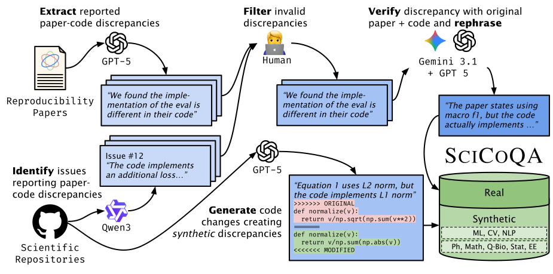

# SciCoQA: Quality Assurance for Scientific Paper-Code Alignment

<div align="center">

[](https://arxiv.org/abs/2601.12910)
[](https://github.com/UKPLab/scicoqa)
[](https://ukplab.github.io/scicoqa)
[](https://huggingface.co/datasets/UKPLab/scicoqa)
[](https://huggingface.co/spaces/UKPLab/scicoqa)

</div>

A dataset and codebase for detecting discrepancies between scientific publications and their code implementations.



## Table of Contents

- [News](#news)
- [Dataset](#dataset)
- [Quick Start](#quick-start)
- [Setup](#setup)
- [Project Structure](#project-structure)
- [Dataset Creation](#dataset-creation)
- [Inference](#inference)
- [Evaluation](#evaluation)
- [License](#license)

---

## News

### 20/03/2026: SciCoQA V1.1 + Gemini 3.1 Pro Evals + Extended Human Validation Data

#### SciCoQA V1.1

We added 11 new real-world and 13 additional synthetic discrepancies. The additional real-world data was obtained by running the final Verify + Rephrase step also with Gemini 3.1 Pro. Now most samples in the data have two discrepancy descriptions. There are few cases where only one of the models judged the discrepancy to be valid. For these we have manually verified them and only included valid ones. Further we added 13 additional synthetic discrepancies that were labeled as *Paper Omissions*, as we found these to be the most challenging cases for LLMs to detect. They were initially discarded during synthetic data sampling, but we have now added them. The updated data is available in [Hugging Face](https://huggingface.co/datasets/UKPLab/scicoqa) and in the data dir. For all the new data we also added the predictions and evals of the previously evaluated models.

#### Gemini 3.1 Pro Evals

We added Gemini 3.1  evaluations and the results can be found in the paper. As before, we release all predictions from the model.

#### Extended Human Validation Data

We further release the data from our precision analysis. Specifically, we looked at GPT-5, Gemini 2.5 Pro and GPT-OSS 20B's predictions on 20 papers from NLP and CV and validate whether the detected discrepancies by these models actually exist or not. This data gives a more complete picture on the *Precision* of models.

## Dataset

The dataset is available on HuggingFace: [**UKPLab/scicoqa**](https://huggingface.co/datasets/UKPLab/scicoqa)

It consists of paper-code discrepancies with two splits:

- **`real`**: 92 real-world discrepancies from GitHub issues and reproducibility papers
- **`synthetic`**: 543 synthetically generated discrepancies

Local copies are also available in `data/` as JSON Lines files.

### Data Format

Each entry contains:

- **Paper information**: URL and versioned PDF link
- **Code information**: Repository URL and commit hash
- **Discrepancy details**: Description of the mismatch between paper and code
- **Relevant paper sections**: Quotes from the paper
- **Relevant code files**: List of code files where the discrepancy occurs
- **Origin metadata**: Source (GitHub issue, reproducibility paper, or synthetic)
- **Changed code** (synthetic only): Code files and snippets that were modified

Example entry:

```json
{
  "discrepancy_id": "63197a77",
  "paper_url": "https://arxiv.org/abs/2106.09685",
  "paper_url_versioned": "https://arxiv.org/pdf/2106.09685v2.pdf",
  "code_url": "https://github.com/microsoft/LoRA",
  "code_url_versioned": "https://github.com/microsoft/LoRA/tree/a0d5efec36d74b5dce257492cc6943402573c4f3",
  "discrepancy_date": "2023-07-10T03:22:51.000Z",
  "origin_type": "GitHub Issue",
  "origin_url": "https://github.com/microsoft/LoRA/issues/98",
  "origin_discrepancy_text": "AB matrix initialization in layers.py does not conform ...",
  "is_valid_discrepancy_gemini": true,
  "is_valid_discrepancy_gpt": true,
  "is_valid_discrepancy_reason_gemini": "The paper states that matrix A is initialized ...",
  "is_valid_discrepancy_reason_gpt": "The paper states that A should be randomly ...",
  "discrepancy_description_gemini": "The paper describes the initialization of the low-rank ...",
  "discrepancy_description_gpt": "In Section 4.1, the paper specifies an initialization ...",
  "relevant_paper_sections_gemini": [
    "We use a random Gaussian initialization for $A$ and zero for $B$, so $\\Delta W=B ..."
  ],
  "relevant_paper_sections_gpt": [
    "We use a random Gaussian initialization for A and zero for B, so ΔW=BA is zero ..."
  ],
  "relevant_code_files_gemini": [
    "loralib/layers.py"
  ],
  "relevant_code_files_gpt": [
    "loralib/layers.py"
  ],
  "changed_code_files": {
    "file_name": [],
    "discrepancy_code": []
  },
  "changed_code_snippets": {
    "original_file": [],
    "original_code": [],
    "changed_code": []
  },
  "discrepancy_type": "Difference",
  "discrepancy_category": "Model",
  "arxiv_subject": "cs",
  "arxiv_categories": [
    "cs.CL",
    "cs.AI",
    "cs.LG"
  ],
  "arxiv_year": 2021
}
```

---

## Quick Start

**Load the dataset from HuggingFace**:

```python
from datasets import load_dataset

# Load from HuggingFace Hub
dataset = load_dataset("UKPLab/scicoqa")

# Access splits
real_data = dataset["real"]
synthetic_data = dataset["synthetic"]

# Access discrepancy information
discrepancy = real_data[0]
print(f"Paper: {discrepancy['paper_url']}")
print(f"Code: {discrepancy['code_url']}")
print(f"Description: {discrepancy['discrepancy_description_gpt']}")
```

**Using the SciCoQA library**:

```python
from scicoqa.core import load_scicoqa

# Load as pandas DataFrame
df_real = load_scicoqa(split="real")
df_synthetic = load_scicoqa(split="synthetic")

# Or load from local files
df_real = load_scicoqa(split="real", use_local=True)
```

---

## Setup

### Dependencies

The project uses `uv` for package management. You can also use other package managers (pip, poetry, etc.) by installing dependencies from `pyproject.toml`.

**With uv** (recommended):

```bash
uv venv .venv
source .venv/bin/activate  # On Windows: .venv\Scripts\activate
uv sync
```

**With pip**:

```bash
python -m venv .venv
source .venv/bin/activate
pip install -e .
```

**Requirements**: Python 3.13+

### Environment Variables

Create a `.env` file in the root directory with the following:

- `OLLAMA_API_BASE`: Base URL of the Ollama instance
- `VLLM_API_BASE`: Base URL of the VLLM instance
- `MISTRAL_API_KEY`: API key for Mistral API
- `OPENAI_API_KEY`: API key for OpenAI API
- `GEMINI_API_KEY`: API key for Gemini API
- `GITHUB_TOKEN`: GitHub token for API access
- `HF_TOKEN`: Hugging Face token for model downloads

**Note**: The dataset files can be used without API keys. API keys are only needed for running inference and evaluation.

### Extracting Pre-generated Results

The archives are located in the `out/` directory and are split as follows:

- `out/data_collection.tar.gz`: Contains all data collection outputs (GitHub classification, validation, reproducibility extraction, etc.)
- `out/inference_discrepancy_detection_real.tar.gz`: Contains inference results on real data (both full and code_only)
- `out/inference_discrepancy_detection_synthetic_code_only.tar.gz`: Contains inference results on synthetic data (code_only experiments)
- `out/inference_discrepancy_detection_synthetic_full.tar.gz`: Contains inference results on synthetic data (full context experiments)
- `out/inference_*.tar.gz`: Any other inference-related archives

Each archive contains only the following file types:

- `generations.jsonl`: Model generation outputs
- `discrepancy_issues-positives.jsonl`: Classified discrepancy issues
- `predictions_and_classifications.jsonl`: Predictions and classifications
- `classifications.json`: Classification results
- `similarities.jsonl`: Similarity scores

To extract all archives and restore the `out/` directory structure:

```bash
./scripts/uncompress_out.sh
```

## Project Structure

```
scicoqa-submission-arr-januar-2026/
├── data/
│   ├── scicoqa-real-v1.0.jsonl      		# Real-world discrepancies (81 entries)
│   ├── scicoqa-real-v1.1.jsonl      		# Real-world discrepancies (92 entries), updated version with 11 new discrepancies
│   └── scicoqa-synthetic-v1.0.jsonl 		# Synthetic discrepancies (530 entries)
│   └── scicoqa-synthetic-v1.1.jsonl 		# Synthetic discrepancies (543 entries), updated version with 13 new discrepancies
├── config/
│   ├── data.yaml                    		# Repository metadata, reproducibility paper info
│   ├── models.yaml                  		# LLM configurations (GPT, Gemini, etc.)
│   └── prompts.yaml                 		# Prompts for discrepancy detection, generation, etc.
├── scicoqa/
│   ├── core/                        		# Core functionality (LLM interface, experiment management)
│   ├── github/                      		# GitHub crawling and issue processing
│   ├── inference/                   		# Inference scripts (discrepancy detection, generation)
│   └── evaluation/                  		# Evaluation and metrics computation
├── out/                             		# Output directory
│   ├── data_collection/             		# Dataset curation outputs
│   │   ├── github_crawl/            		# GitHub repository crawl results
│   │   ├── github_classification/   		# GitHub issue classification
│   │   ├── github_validation/       		# GitHub discrepancy validation
│   │   ├── reproducibility_extraction/     	# Extract discrepancies from papers
│   │   ├── reproducibility_validation/     	# Validate paper discrepancies
│   │   └── synthetic_generation/           	# Generate synthetic discrepancies
│   └── inference/                   		# Model inference results
│       └── discrepancy_detection/   		# Discrepancy detection experiments
│           ├── real/                		# Experiments on real data
│           │   ├── full/            		# Full paper + code context
│           │   └── code_only/       		# Ablation: code only
│           └── synthetic/           		# Experiments on synthetic data
│               ├── full/
│               └── code_only/
├── extract_out.sh                   		# Script to extract archives and restore out/
├── pyproject.toml                    		# Project dependencies and configuration
└── README.md                        		# This file
```

### Key Files

- **HuggingFace Dataset**: [`UKPLab/scicoqa`](https://huggingface.co/datasets/UKPLab/scicoqa) - Primary source for the dataset
- **Local dataset files** (`data/*.jsonl`): Local copies of the benchmark data in JSON Lines format
- **Configuration** (`config/*.yaml`): All model, prompt, and data configurations
- **Inference scripts** (`scicoqa/inference/*.py`): Run discrepancy detection, synthetic generation, etc.
- **Core library** (`scicoqa/core/`): Reusable components for LLM interaction, prompting, dataset loading, and experiment tracking

## Dataset Creation

### 1. Real Data

#### GitHub Crawl

To run the GitHub crawl, you need to provide the search string, qualifiers, and filter homepage by. For example, to crawl all repositories from arXiv between 2025-01-01 and 2025-01-07, run the following command:

```bash
start_date="2025-01-01"
end_date="2025-01-07"
search_str="arxiv.org"
filter_homepage_by="${search_str}"

uv run python scicoqa/github/crawl.py \
    --search_str "${search_str}" \
    --qualifiers "sort:stars" "order:desc" "created:${start_date}..${end_date}" \
    --filter_homepage_by "${filter_homepage_by}"
```

For the dataset we use, we crawled all repositories from arXiv between 2020-01-01 and 2025-09-30, and filtered the repositories by the homepage being `arxiv.org`, `openreview.net`, `aclanthology.org`, `doi.org/10.1145`.

For arxiv, the crawl should be performed on a weekly basis, since typically there are many papers. For others, the crawl can be performed on a monthly basis.

#### GitHub Issue Classification

To classify the GitHub issues, we used Qwen3 4B Thinking with Ollama. To reproduce, first make sure have access to an Ollama instance and set the `OLLAMA_API_BASE` environment variable to the host of the Ollama instance. Then, run the following command:

```bash
uv run python -m scicoqa.inference.github_classification --model qwen-3-4b-thinking --prompt github_issue_discrepancy_classification_v2 --dir_suffix qwen_3_4b_think --decoding_config low_temperature
```

Using the output of the issue classification, we manually annotated the discrepancies and saved the annotated discrepancies in `discrepancy_issues-positives.jsonl`

#### GitHub Issue Verification

Finally, to verify the discrepancies, we used GPT-5 and Gemini 3.1 Pro.

```bash
uv run python -m scicoqa.inference.github_validation --model gpt-5 --prompt discrepancy_issue_verification_v2 --dir_suffix gpt_5 --decoding_config gpt_5_high_reasoning --discrepancy_file discrepancy_issues-positives.jsonl --add_comments 
```

#### Reproducibility Paper Extraction

To extract the discrepancies from the reproducibility papers, we used GPT-5. To reproduce, run the following command:

```bash
uv run python -m scicoqa.inference.reproducibility_extraction --prompt reproducibility_report_discrepancy_extraction_v3 --iterate_over reproducibility_paper --model gpt-5 --decoding_config gpt_5_high_reasoning
```

#### Reproducibility Paper Verification

To verify the discrepancies from the reproducibility papers, we used GPT-5 and Gemini 3.1 Pro. To reproduce, run the following command:

```bash
uv run python -m scicoqa.inference.reproducibility_validation --prompt reproducibility_report_discrepancy_verification --model gpt-5 --decoding_config gpt_5_high_reasoning
```

### 2. Synthetic Data

#### Synthetic Data Generation

For **Computer Science papers**:

```bash
uv run python -m scicoqa.inference.synthetic_generation \
    --model gpt-5 \
    --dir_suffix gpt-5 \
    --decoding_config gpt_5_high_reasoning \
    --num_discrepancies 5 \
    --prompt synthetic_discrepancy_generation_cs \
    --data_config_section synthetic_discrepancies_cs \
    --paper_url_field arxiv_url_versioned
```

For **non-CS papers** (Physics, Biology, etc.):

```bash
uv run python -m scicoqa.inference.synthetic_generation \
    --model gpt-5 \
    --dir_suffix gpt-5 \
    --decoding_config gpt_5_high_reasoning \
    --num_discrepancies 5 \
    --prompt synthetic_discrepancy_generation_v2 \
    --data_config_section synthetic_discrepancies \
    --paper_url_field arxiv_url
```

**Note**: Synthetic generation requires GPT-5 API access. Repository metadata is configured in `config/data.yaml`.

## Inference

To run inference, run the following command.

**Parameters**:

- `--dataset_split`: Dataset split to use (`real` or `synthetic`). Default: `real`.
- `--prompt`: Prompt template. Use `discrepancy_generation` for full context or `discrepancy_generation_code_only` for the code-only ablation.
- `--model`: The model to use for inference. See `config/models.yaml` for available models.
- `--use_local`: (Optional) Use local JSONL files instead of HuggingFace Hub.

**Note**: The output directory is automatically determined based on the dataset and prompt:

- Real + Full context → `out/inference/discrepancy_detection/real/full/`
- Real + Code only → `out/inference/discrepancy_detection/real/code_only/`
- Synthetic + Full context → `out/inference/discrepancy_detection/synthetic/full/`
- Synthetic + Code only → `out/inference/discrepancy_detection/synthetic/code_only/`

The run directory name will automatically include the model name as a suffix (e.g., `discrepancy_gen-001-gpt-5` for real data, `discrepancy_gen_synthetic-001-gpt-5` for synthetic data). You can override this by explicitly setting `--dir_suffix`.

**Example: Run on real data with full context**

```bash
uv run python -m scicoqa.inference.discrepancy_detection \
    --model gpt-5-flex \
    --decoding_config gpt_5_high_reasoning \
    --prompt discrepancy_generation \
    --dataset_split real
```

**Example: Run on synthetic data with code-only ablation**

```bash
uv run python -m scicoqa.inference.discrepancy_detection \
    --model gpt-5-flex \
    --decoding_config gpt_5_high_reasoning \
    --prompt discrepancy_generation_code_only \
    --dataset_split synthetic
```

**Example: Use local files instead of HuggingFace**

```bash
uv run python -m scicoqa.inference.discrepancy_detection \
    --model gpt-5-flex \
    --decoding_config gpt_5_high_reasoning \
    --prompt discrepancy_generation \
    --dataset_split real \
    --use_local
```

## Evaluation

### Running Evaluation

Deploy GPT-OSS 20B on VLLM, then run:

```bash
GENERATIONS_DIR=out/inference/discrepancy_detection/real/full/discrepancy_gen-002-gpt-5-nano
uv run python -m scicoqa.inference.discrepancy_eval \
    --model "vllm-gpt-oss-20b" \
    --generations_dir $GENERATIONS_DIR \
    --vllm_server_url "http://localhost:11435/v1" \
    --dataset_split real
```

For synthetic data evaluation:

```bash
GENERATIONS_DIR=out/inference/discrepancy_detection/synthetic/full/discrepancy_gen_synthetic-001-gpt-5
uv run python -m scicoqa.inference.discrepancy_eval \
    --model "vllm-gpt-oss-20b" \
    --generations_dir $GENERATIONS_DIR \
    --vllm_server_url "http://localhost:11435/v1" \
    --dataset_split synthetic
```

This creates an `eval_v2` directory in the generations directory with evaluation results.

### Computing Recall

To compute recall metrics across all runs:

```bash
# Compute recall for all experiments
uv run python -m scicoqa.evaluation.compute_recall

# Or specify a specific directory
uv run python -m scicoqa.evaluation.compute_recall \
    --base-dir out/inference/discrepancy_detection/real/full
```

This outputs recall scores broken down by:

- Real vs. Synthetic
- Code-only vs. Full context
- Overall performance metrics

### Available Models

Models are configured in `config/models.yaml`:

**Proprietary**: GPT-5 (variants), Gemini 2.5 (variants)

**Open-weight** (via VLLM/Ollama): GPT-OSS, Qwen3, DeepSeek, Nemotron, Devstral, Magistral

---

## Pre-generated Results

The `out/` directory contains pre-generated results:

- `out/inference/discrepancy_detection/real/full/`: Model predictions on real data (full context)
- `out/inference/discrepancy_detection/real/code_only/`: Code-only ablation on real data
- `out/inference/discrepancy_detection/synthetic/full/`: Predictions on synthetic data
- `out/data_collection/github_validation/`: Discrepancy validation results

These can be used to compute metrics without re-running inference.

## License

This project uses dual licensing:

- **Code**: Apache 2.0 - see the [LICENSE](LICENSE) file for details
- **Dataset** (`data/*.jsonl`): [Creative Commons Attribution 4.0 International (CC-BY 4.0)](https://creativecommons.org/licenses/by/4.0/)

When using the dataset, please provide appropriate attribution as specified in the CC-BY 4.0 license.
