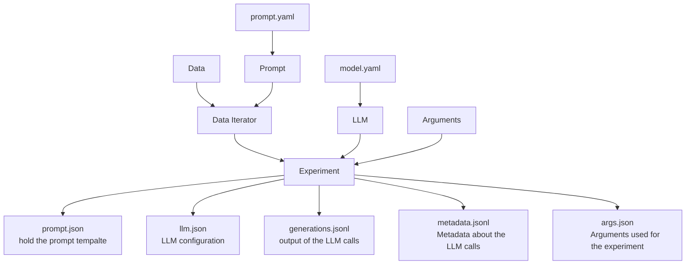

# SciCoQA Core Library

The core libary's purpose is to provide a systematic, reproducible and extensible way to perform inference with LLMs.

Therefore, each inference experiment consists of the following components:
- A model, including configuration defined in [config/models.yaml](../../config/models.yaml), which instantiates an [LLM](./llm.py) object
- A prompt, defined in [config/prompts.yaml](../../config/prompts.yaml), which instantiates a [Prompt](./prompt.py) object
- A data iterator, defined in [data_iterator.py](./data_iterator.py), which instantiates a [BaseIterator](./data_iterator.py) object
- An arguments class, defined in [args.py](./args.py), which instantiates a [BaseArgs](./args.py) object to handle common arguments for all experiments
- An experiment, defined in [experiment.py](./experiment.py) which orchestrates the other components

